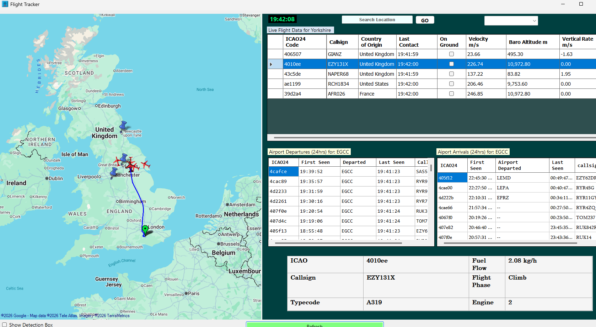

# Measuring the performance of real-time aircrafts

A C# Windows Forms application that visualises live aircraft movements using ADS-B data from the OpenSky Network and estimates insantaneous aircraft fuel consumption using engine performance data from the ICAO/EASA emissions databank.

## Features

- Real-time aircraft tracking and visualisation
- Interactive map displaying aircraft positions and headings
- Real time aircraft information dashboard
- Airport arrivals and departures search
- Flight path visualisation
- Aircraft-specific fuel consumption estimates
- Arrivals and Departures by Airport
- OAuth2 authenticated API integration
- Dynamic map-based aircraft filtering
- area specifc tracking eg Yorkshire

## Technologies Used

- C#
- .NET Windows Forms
- OpenSky Network API
- OAuth2 Authentication
- GMap.NET
- Newtonsoft.Json
- CSVHelper
- REST API
- CSV Data Processing

## Project Overview

This project was developed as a final-year Computing project and explores how real-time aviation data can be combined with aircraft performance information to provide environmental insights that are not available in existing flight tracking platforms such as flighttracker24.

The application retrieves live flight information from the OpenSky Network, visualises aircraft on an interactive map, and uses aircraft-specific engine coefficients derived from the ICAO/EASA emissions databank to estimate instantaneous fuel consumption based on flight phase and performance characteristics.

## Key Learning Outcomes

- Consuming and processing real-time REST API data
- Implementing OAuth2 authentication workflows
- Handling asynchronous API requests in C#
- Integrating multiple aviation data sources
- Visualising geographic data using GIS mapping tools
- Designing and evaluating a software solution using Agile methodologies

## Screenshots

### Main Flight Tracker

### Flight Path Visualisation

### Fuel Consumption Metrics

## Future Improvements

- Total flight fuel consumption calculations (Interval Fuel Consumption)
- Expanding aircraft performance database with further aircrafts and their engine types
- Higher-frequency updates using a local ADS-B receiver
- Cross-platform deployment using .NET MAUI
- Additional environmental metrics and visualisations

## Project Outcome

The project was successfully demonstrated at the University Computing Showcase and achieved a **First-Class grade**.

